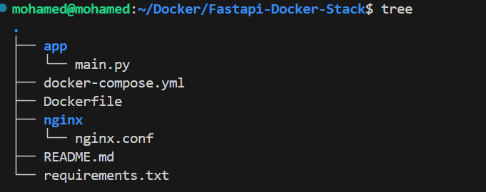
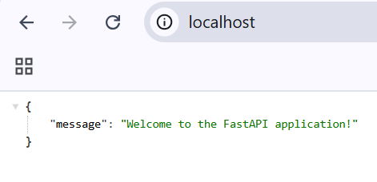
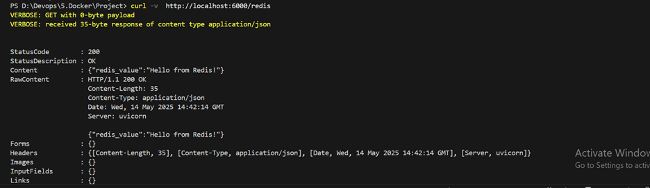
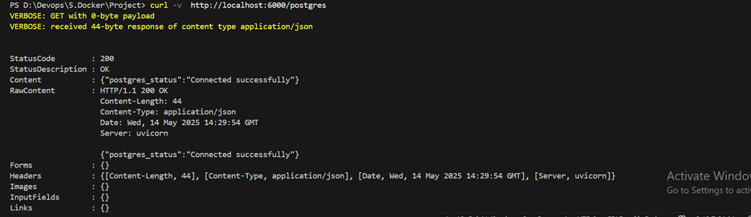
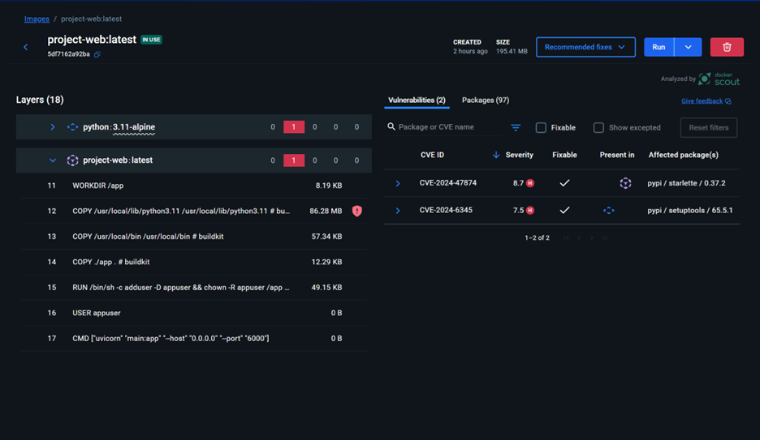

# 🚀 FastAPI Docker Stack Overview

A production-ready FastAPI application with Docker, PostgreSQL, Redis, and Nginx reverse proxy. Built for scalable backend development with service isolation and container orchestration.

## 📦 Features

- ⚡ **FastAPI** — High-performance Python API framework
- 🐳 **Docker & Compose** — Containerized architecture
- 🐘 **PostgreSQL** — Robust SQL database
- 🚀 **Redis** — In-memory caching and message queuing
- 🌐 **Nginx** — Reverse proxy for production environments
- 🔧 **Developer-friendly** — Easy local development and deployment

## 🏗️ Architecture


The stack implements a modern containerized architecture where:
- FastAPI handles HTTP requests and business logic
- PostgreSQL provides persistent data storage
- Redis enables caching and message queuing
- Nginx serves as a reverse proxy, routing external traffic to the application

## 🛠️ Service Configuration

| Service | Role                      | Port         |
|---------|---------------------------|--------------|
| `web`   | FastAPI app               | `6000`       |
| `db`    | PostgreSQL database       | `5432`       |
| `cache` | Redis in-memory store     | `6379`       |
| `proxy` | Nginx reverse proxy       | `80` → `6000` |

## 📁 Project Structure


.
├── app/
│   ├── main.py     # FastAPI entrypoint
│   └── ...
├── requirements.txt    # Python dependencies
├── Dockerfile          # Docker build for FastAPI
├── docker-compose.yml  # Multi-container setup
└── README.md           # Documentation

## 🚀 Quick Start

### Clone and Launch

```bash
# Clone repository
git clone https://github.com/Mohameed-Magdy-Dewidar/fastapi-docker-stack.git

cd fastapi-docker-stack

# Start all services
docker-compose up --build

🧪 Testing Endpoints

API Endpoints
bash# Root endpoint

curl -v http://localhost/


bash# Redis connection
curl -v http://localhost/redis



bash# PostgreSQL connection
curl -v http://localhost/postgres



🔒 Security
The application's Docker image has been scanned using Docker Scout:


The current scan shows only one high-severity vulnerability, making it relatively secure for most deployment scenarios.